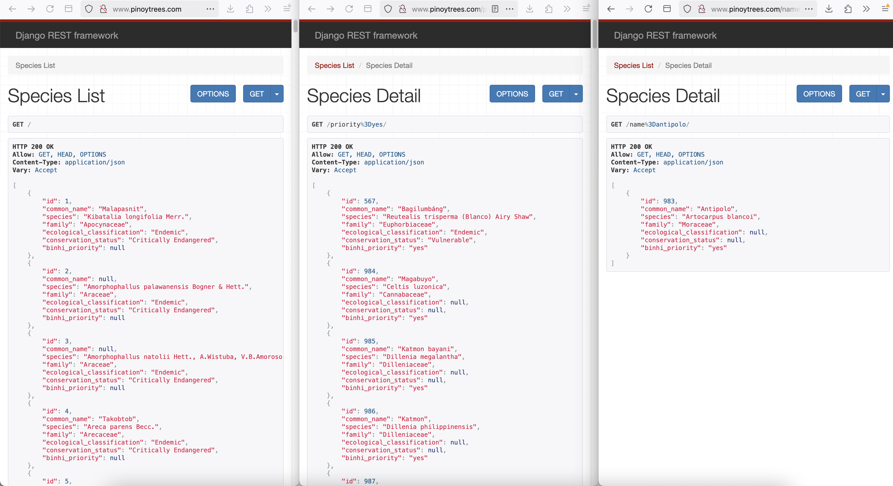

### WIP API for Philippine Native Trees (PNT) 
* Centralize common information  about our beloved trees
* Help other developers/PNT enthusiasts build related projects
* Check it out at http://www.pinoytrees.com/ 

#### Quick guide
* Only single-field case-insensitive search is allowed
    * `name=Smooth%20Narra`
    * `species=Dipterocarpus validus`
    * `family=Lamiaceae`
    * `classification=endemic`
    * `status=vulnerable`
    * `priority=yes`
        * Based on https://binhi.ph/trees/

## Features coming soon
* Complete list of BINHI priority species
* Multi-field search so you can check, for example, which species of the Ebenaceae family are Critically Endangered
* List suitable species to plant based on climate, location, and elevation as modelled from "Philippine Native Trees – What to Plant in Different Provinces"

http://www.pinoytrees.com/